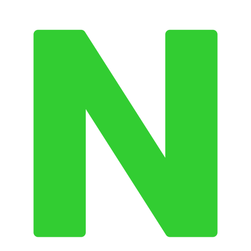
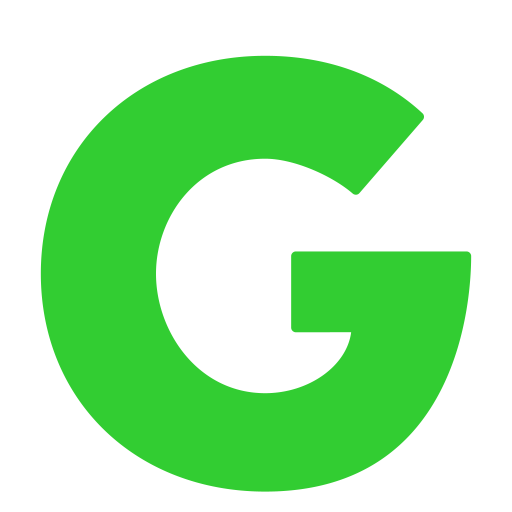

# <u style="font-style: italic; color: #7c7c7c;">Learn JSON</u>

---

## About the Project Owner

- Name <u style="text-decoration-color: #32cd32;">Mohamed Sadawy Thabet</u> (M3MD69)
- Field <u style="text-decoration-color: #32cd32;">Software Engineer</u> / <u style="text-decoration-color: #32cd32;">Native Android Developer</u>
-  Accounts
    <ul>
        <li> Telegram Accounts</li>
        <ul>
            <li> Private <a style="color: limeGreen;" href="https://t.me/M3MD69">@M3MD69</a></li>
            <li> Nullexia For Programming <a style="color: limeGreen;" href="https://t.me/Nullexia">@Nullexia</a></li>
            <li> Software Consulting <a style="color: limeGreen;" href="https://t.me/SoftwareConsulting">@SoftwareConsulting</a></li>
        </ul>
        <li> Github <a style="color: limeGreen;" href="https://github.com/M3MD69">@M3MD69</a></li>
    </ul>

---

## About the Project Details

- **Recommended using** `WebStorm, Intellij IDEA (Community / Ultimate / EAP), Aqua`
- **Currently Used** `Intellij IDEA (Community)`

---

## 1. [Learn](src/_1_learn)

- <u style="text-decoration-color: #7c7c7c;">Learn Examples of Concepts</u>.

### 1. [Syntax](src/_1_learn/_1_1_syntax)

### 2. [Schema](src/_1_learn/_1_2_schema)

---

## Resources

### Learn

- Note: <u style="text-decoration-color: #7c7c7c;">After learning from the sources, what was explained in the project is explained in my ways not copied mostly</u>.

#### Websites

<ul>
<li><a style="color: #7c7c7c;" href="https://satr.codes">Satr</a></li>
<del><li><a style="color: #7c7c7c;" href="https://www.json.org/json-en.html">JSON Documents</a></li></del>
</ul>